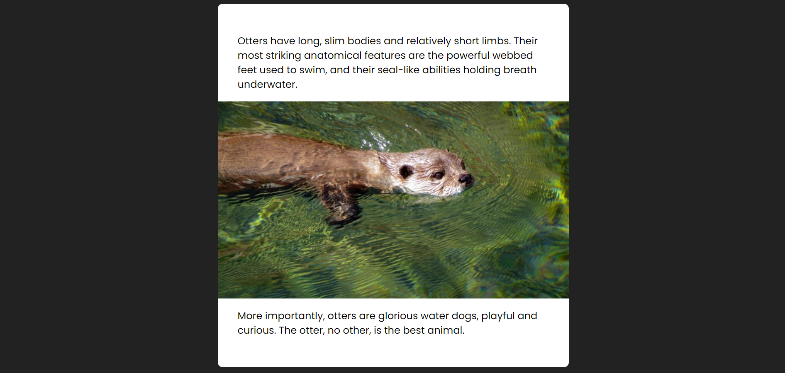
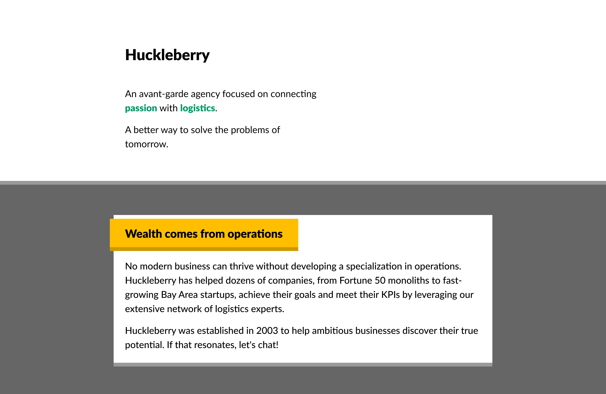

# Flow Layout Exercises

## Offset Title

Make something like this.

## Stretch Out

And then make this.

## Agency Page

In this workshop, you'll build a minimal landing page for an agency.

This mockup is built entirely using _flow layout_: no Flexbox, no grid, no absolute positioning, no media queries. It relies heavily on padding, margin, and border, as well as some of the tricks we learned in before.

The design is available on Figma:

- https://www.figma.com/file/6hGqKA5scrZJScb9KW3Hj2/Huckleberry
